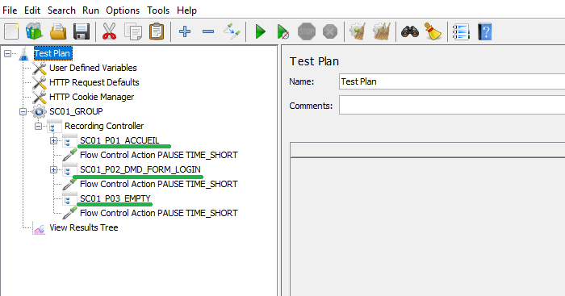
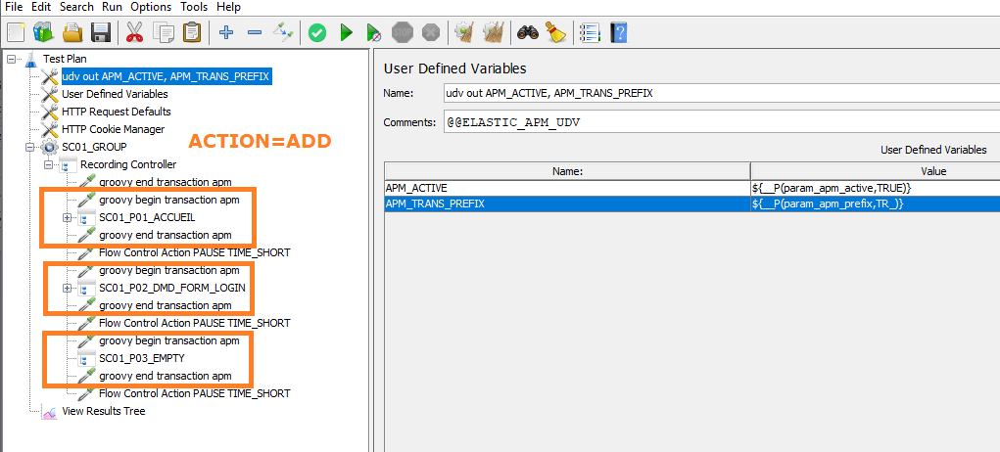
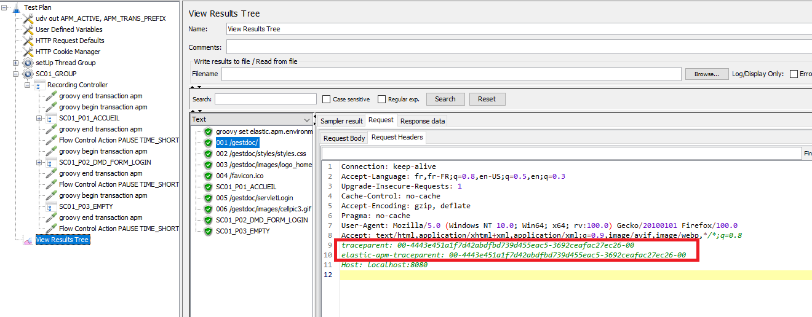
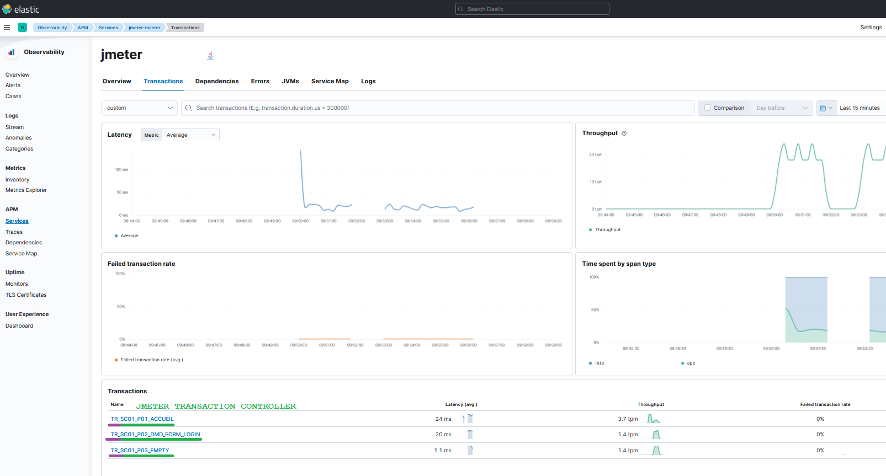
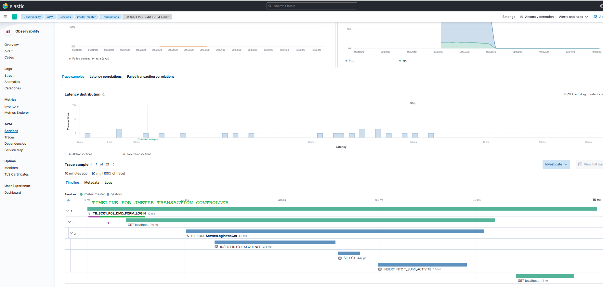
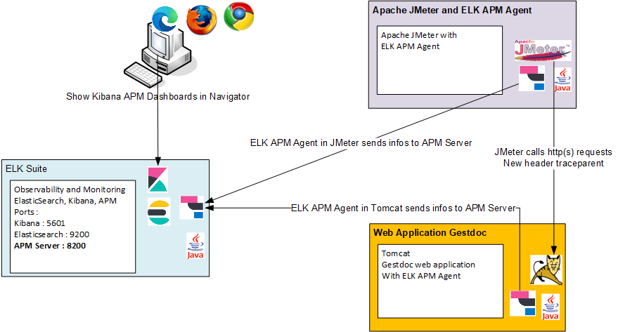
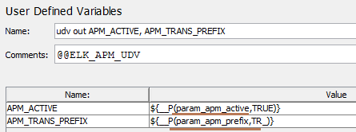

<p align="center">


  <p align="center">Manages the integration of ElasticSearch Application Performance Monitoring API in the Apache JMeter.</p>
  <p align="center"><a href="https://github.com/vdaburon/jmeter-elk-apm">Link to github project jmeter-elk-apm</a></p>
</p>

# Apache JMeter with integration of ElasticSearch Application Performance Monitoring
This tool manages the integration of ElasticSearch Application Performance Monitoring API in the Apache JMeter.

The main goal is to show the timeline of pages declared in JMeter script in the Kibana APM. For each page on the JMeter side, have all the server-side calls grouped together, the SQL queries and the inter-application exchanges in the notion of page.

This tool adds JSR223 groovy sampler to create a new APM Transaction before a JMeter Transaction Controller
and adds JSR223 groovy sampler to end the transaction after the JMeter Transaction Controller

This tool **adds** also User Defined Variables for ELK APM configuration

This tool could **remove** all JSR223 groovy that contains api calls to return to the initial JMeter script.

##  Example
A simple JMeter script with 3 Transaction Controller corresponding to 3 different pages



Launch the tool to modify the script : script1.jmx
<pre>
java -jar jmeter-elk-apm-&lt;version&gt;-jar-with-dependencies.jar -file_in script1.jmx -file_out script1_add.jmx -action ADD -regex SC.*
</pre>
and the script (script1_add.jmx) after **action** = **ADD**

Each JMeter Transaction Controller (page) is surround with a begin transaction and an end transaction (use groovy api call).

In the "groovy begin transaction apm", the groovy code calls the ElasticApm API (simplified code) :
<pre>
Transaction transaction = ElasticApm.startTransaction();
Scope scope = transaction.activate();
transaction.setName(transactionName); // contains the JMeter Transaction Controller Name
</pre>

And in the "groovy end transaction apm", the groovy code calls the ElasticApmp API  (simplified code):
<pre>
transaction.end();
</pre>



In View Results Tree, you will see new request headers (traceparent and elastic-apm-traceparent) automatically added by the elastic apm agent with the transaction id (e.g: 4443e451a1f7d42abdfbd739d455eac5) created by the jsr223 groovy begin transaction apm.



You will see all Transactions in Kibana with the vision of the page in JMeter (JMeter Transaction Controller usually == page) (click on image to see the full size image)



And the TIMELINE for JMeter Transaction Controller, you see the JMeter Page and the web application gestdoc running in Tomcat (click on image to see the full size image)



## Simplified architecture diagram
The simplified architecture : Apache JMeter and a java apm agent, Apache Tomcat and the java apm agent with web application gestdoc, ElasticSearch suite with ElasticSearch, APM Server and Kibana, a user views the Kibana Dashboards with navigator.



## License
See the LICENSE file Apache 2 [https://www.apache.org/licenses/LICENSE-2.0](https://www.apache.org/licenses/LICENSE-2.0)

## Ready to use
In the [Release of the project](https://github.com/vdaburon/jmeter-elk-apm/releases)  you will find the tool compiled in one (uber) jar file which is directly usable.

## Help
<pre>
[main] INFO io.github.vdaburon.jmeter.elkapmxml.ElkApmJMeterManager - main begin
usage: io.github.vdaburon.jmeter.elkapmxml.ElkApmJMeterManager -action &lt;action&gt; [-extract_end &lt;extract_end&gt;]
       [-extract_start &lt;extract_start&gt;] [-extract_udv &lt;extract_udv&gt;] -file_in &lt;file_in&gt; -file_out &lt;file_out&gt; [-help]
       [-regex &lt;regex&gt;]
io.github.vdaburon.jmeter.elkapmxml.ElkApmJMeterManager
 -action &lt;action&gt;                 action ADD or REMOVE, ADD : add groovy api call and REMOVE : remove groovy api call
 -extract_end &lt;extract_end&gt;       optional, file contains groovy end call api (e.g : extract_end.xml), default read file
                                  in the jar
 -extract_start &lt;extract_start&gt;   optional, file contains groovy start call api (e.g : extract_start.xml), default read
                                  file in the jar
 -extract_udv &lt;extract_udv&gt;       optional, file contains User Defined Variables (e.g : extract_udv.xml), default read
                                  file in the jar
 -file_in &lt;file_in&gt;               JMeter file to read (e.g : script.jmx)
 -file_out &lt;file_out&gt;             JMeter file modified to write (e.g : script_add.jmx)
 -help                            Help and show parameters
 -regex &lt;regex&gt;                   regular expression matches Transaction Controller Label (default .*) (e.g : SC[0-9]+_.
                                  for SC01_P01_HOME or SC09_P12_LOGOUT)
E.g : java -jar jmeter-elk-apm-&lt;version&gt;-jar-with-dependencies.jar -file_in script1.jmx -file_out script1_add.jmx
-action ADD -regex SC.*
E.g : java -jar jmeter-elk-apm-&lt;version&gt;-jar-with-dependencies.jar -file_in script1_add.jmx -file_out
script1_remove.jmx -action REMOVE -regex .*
[main] INFO io.github.vdaburon.jmeter.elkapmxml.ElkApmJMeterManager - main end (exit 1) ERROR

</pre>

## Properties in the User Defined Variables

This tool add "User Defined Variables" with default value



This variables could be changed with JMeter properties at launch time, this properties could be set with -J&lt;property&gt;

ELK APM properties are :

| property name    | comment                                                                                          |
|------------------|--------------------------------------------------------------------------------------------------|
| param_apm_active | default : TRUE , TRUE OR FALSE, if TRUE then api is call                                         |
| param_apm_prefix | default : TR_ , Prefix of the transaction name, could be empty, SC01_LOGIN will be TR_SC01_LOGIN |

E.g : jmeter -Jparam_apm_prefix=TRANS_ , SC01_LOGIN will be TRANS_SC01_LOGIN in Kibana transactions list

## Limitation at one level Transaction Controller
The main limitation of this tool is only one Transaction Controller level. You can't instrument a Transaction Controller that contains others Transaction Controller because the groovy script use ONE variable to save the Transaction Controller Label. The Parent Transaction Controller set the label and the children Transaction Controller set the same variable and overwrite previous parent label. As a result, the parent will not have an end of transaction.

You can manually remove the groovy code before the parent Transaction Controller or give the regular expression for only children Transaction Controller.

## Start Apache JMeter with ELK APM agent and ELK APM api library

### Declare the elastic apm agent

Url to find the apm agent : [https://mvnrepository.com/artifact/co.elastic.apm/elastic-apm-agent](https://mvnrepository.com/artifact/co.elastic.apm/elastic-apm-agent)

Add the ELK apm agent somewhere in the filesystem (could be in the &lt;JMETER_HOME&gt;\lib but not mandatory)

In &lt;JMETER_HOME&gt;\bin modify the jmeter.bat or setenv.bat

Add ELK APM configuration likes :
<pre>
set APM_SERVICE_NAME=yourServiceName
set APM_ENVIRONMENT=yourEnvironment
set APM_SERVER_URL=http://apm_host:8200

set JVM_ARGS=-javaagent:&lt;PATH_TO_AGENT_APM_JAR&gt;\elastic-apm-agent-&lt;version&gt;.jar -Delastic.apm.service_name=%APM_SERVICE_NAME% -Delastic.apm.environment=%APM_ENVIRONMENT% -Delastic.apm.server_urls=%APM_SERVER_URL%
</pre>

Another solution, create a windows shell likes <code>jmeter_with_elkapm.bat</code> in the &lt;JMETER_HOME&gt;\bin:
<pre>
set APM_SERVICE_NAME=yourServiceName
set APM_ENVIRONMENT=yourEnvironment
set APM_SERVER_URL=http://apm_host:8200
set JVM_ARGS=-javaagent:&lt;PATH_TO_AGENT_APM_JAR&gt;\elastic-apm-agent-&lt;version&gt;.jar -Delastic.apm.service_name=%APM_SERVICE_NAME% -Delastic.apm.environment=%APM_ENVIRONMENT% -Delastic.apm.server_urls=%APM_SERVER_URL% & jmeter.bat 
</pre>
Remark the **& jmeter.bat** at end of the line with set JVM_ARGS

### Add the elastic apm library
Add the ELK apm api library in the &lt;JMETER_HOME&gt;\lib\apm-agent-api-&lt;version&gt;.jar

This library is use by JSR223 groovy code.

Url to find the apm library : [https://mvnrepository.com/artifact/co.elastic.apm/apm-agent-api](https://mvnrepository.com/artifact/co.elastic.apm/apm-agent-api)


## Use jmeter maven plugin and ELK java agent
You could launch a load test with the jmeter  maven plugin and elk apm agent

[https://github.com/jmeter-maven-plugin/jmeter-maven-plugin](https://github.com/jmeter-maven-plugin/jmeter-maven-plugin)

Paths are relative to the home maven project
- Put your csv files in <project>/src/test/jmeter directory (e.g : logins.csv)
- Put the apm-agent-api-${elk_apm_version}.jar in <project>/src/test/jmeter directory
- Put  your jmeter script that contains groovy code added with **jmeter-elk-apm** tool in <project>/src/test/jmeter directory (e.g : script1_add.jmx)
- In the maven build section, in the configuration > testPlanLibraries > declare the apm api library <artifact>co.elastic.apm:apm-agent-api:${elk_apm_version}</artifact>
- In the jMeterProcessJVMSettings > arguments add apm agent configuration likes:
<pre>
<jMeterProcessJVMSettings>
<arguments>
<argument>-javaagent:${project.build.directory}/jmeter/testFiles/elastic-apm-agent-${elk_apm_version}.jar</argument>
<argument>-Delastic.apm.service_name=${elk_apm_service_name}</argument>
<argument>-Delastic.apm.environment=${elk_apm_environment}</argument>
<argument>-Delastic.apm.server_urls=${elk_apm_urls}</argument>
</arguments>
</jMeterProcessJVMSettings>
</pre>

A pom.xml example, the elk_apm_version is set to "1.37.0" for the apm agent and the apm library but you could choose another version :
```XML
<project xmlns="http://maven.apache.org/POM/4.0.0" xmlns:xsi="http://www.w3.org/2001/XMLSchema-instance"
         xsi:schemaLocation="http://maven.apache.org/POM/4.0.0 https://maven.apache.org/xsd/maven-4.0.0.xsd">
    <modelVersion>4.0.0</modelVersion>
    <groupId>io.github.vdaburon.jmeter</groupId>
    <artifactId>gestdoc-maven-launch-loadtest-apm</artifactId>
    <version>1.0</version>
    <properties>
        <project.build.sourceEncoding>UTF-8</project.build.sourceEncoding>
        <maven.compiler.source>1.8</maven.compiler.source>
        <maven.compiler.target>1.8</maven.compiler.target>
        <jvm_xms>256</jvm_xms>
        <jvm_xmx>756</jvm_xmx>

        <!-- ELK APM -->
        <elk_apm_version>1.37.0</elk_apm_version>
        <elk_apm_service_name>YourServiceNane</elk_apm_service_name>
        <elk_apm_environment>YourEnvironment</elk_apm_environment>
        <elk_apm_urls>http://apm_server:8200</elk_apm_urls>
    </properties>

    <build>
        <plugins>
            <plugin>
                <!-- launch test : mvn clean verify -->
                <groupId>com.lazerycode.jmeter</groupId>
                <artifactId>jmeter-maven-plugin</artifactId>
                <version>3.6.1</version>
                <executions>
                    <!-- Generate JMeter configuration -->
                    <execution>
                        <id>configuration</id>
                        <goals>
                            <goal>configure</goal>
                        </goals>
                    </execution>
                    <!-- Run JMeter tests -->
                    <execution>
                        <id>jmeter-tests</id>
                        <goals>
                            <goal>jmeter</goal>
                        </goals>
                    </execution>
                </executions>
                <configuration>
                    <jmeterVersion>5.5</jmeterVersion>
                    <testPlanLibraries>
                        <artifact>co.elastic.apm:apm-agent-api:${elk_apm_version}</artifact>
                    </testPlanLibraries>
                    <downloadExtensionDependencies>false</downloadExtensionDependencies>
                    <jMeterProcessJVMSettings>
                        <xms>${jvm_xms}</xms>
                        <xmx>${jvm_xmx}</xmx>
                        <arguments>
                            <argument>-javaagent:${project.build.directory}/jmeter/testFiles/elastic-apm-agent-${elk_apm_version}.jar</argument>
                            <argument>-Delastic.apm.service_name=${elk_apm_service_name}</argument>
                            <argument>-Delastic.apm.environment=${elk_apm_environment}</argument>
                            <argument>-Delastic.apm.server_urls=${elk_apm_urls}</argument>
                            <argument>-Duser.language=en</argument>
                        </arguments>
                    </jMeterProcessJVMSettings>
                    <testFilesIncluded>
                        <jMeterTestFile>script1_add.jmx</jMeterTestFile>
                    </testFilesIncluded>
                    <generateReports>false</generateReports>
                    <testResultsTimestamp>false</testResultsTimestamp>
                    <resultsFileFormat>csv</resultsFileFormat>
                </configuration>
            </plugin>
        </plugins>
    </build>
</project>
```
### Usage Maven
The maven groupId, artifactId and version, this plugin is in the **Maven Central Repository** [](https://maven-badges.herokuapp.com/maven-central/io.github.vdaburon/jmeter-elk-apm)

```xml
<groupId>io.github.vdaburon</groupId>
<artifactId>jmeter-elk-apm</artifactId>
<version>1.1</version>
```

## Advanced usage
### Change the XML extract file
The action ADD of this tool is reading 3 XML files that contains extract of the XML JMeter script to add the 1) "User Defined Variables", 2) "JSR223 groovy begin transaction apm" and 3) "JRS223 groovy end transaction apm".

This files are include in the tool jar file.

You can change the XML files to include by indicating the path to the new XML files with the parameters -extract_udv or -extract_start or -extract_end

You want to change the "JSR223 start transaction apm" with your own file.

E.g. : 
<pre>
java -jar jmeter-elk-apm-&lt;version&gt;-jar-with-dependencies.jar -file_in script1.jmx -file_out script1_add.jmx -action ADD -regex SC.* -extract_start my_xml_file.xml
</pre>

You want to change all 3 files with yours XML files.

E.g. : 
<pre>
java -jar jmeter-elk-apm-&lt;version&gt;-jar-with-dependencies.jar -file_in script1.jmx -file_out script1_add.jmx
-action ADD -regex SC.* -extract_start my_xml_start_file.xml -extract_end my_xml_end_file.xml -extract_udv my_xml_udv_file.xml
</pre>

Another solution is to open the tool jar file with 7zip and replace the 3 files by yours files but keep the same XML file name and save the new jar.

## Reserved tags
This tool is looking to **reserved tags** or special string in the XML extract files or in the JMeter script to **REMOVE** previously add JSR223 Samplers and User Defined Variables.

This tags are :
- In the "JSR223 groovy start transaction apm", the reserved tags are : "@@TC\_NAME" in the Parameters text field, this string will be replaced by the label of the following Transaction Controller and the "@@ELK\_APM\_BEGIN" in the Comment text field
- In the "JRS223 groovy end transaction apm", the reserved tag is "@@ELK\_APM\_END" in the Comment text field
- In the "User Defined Variables", the reserved tag is "@@ELK\_APM\_UDV" in the Comment text field

## Call this tool likes a library
To call this tool in an other tool, add the jar jmeter-elk-apm-&lt;version&gt;-jar and this 2 libraries dependence (common-cli and org.slf4j) in the classpath and :
<pre>
import io.github.vdaburon.jmeter.elkapmxml.ElkApmJMeterManager;

String sRegexTc = ".*";
String sFileIn = "script1.jmx";
String sFileOut = "script1_add.jmx";
ElkApmJMeterManager.modifyAddSamplerForElkApm(sFileIn, sFileOut, ElkApmJMeterManager.ACTION_ADD, sRegexTc, ElkApmJMeterManager.EXTRACT_START_JSR223, ElkApmJMeterManager.EXTRACT_END_JSR223, ElkApmJMeterManager.EXTRACT_UDV_ELK);
</pre>

## Version
Version 1.1 correct the class name in the uber jar and correct REMOVE result

Version 1.0 first version of this tool.
